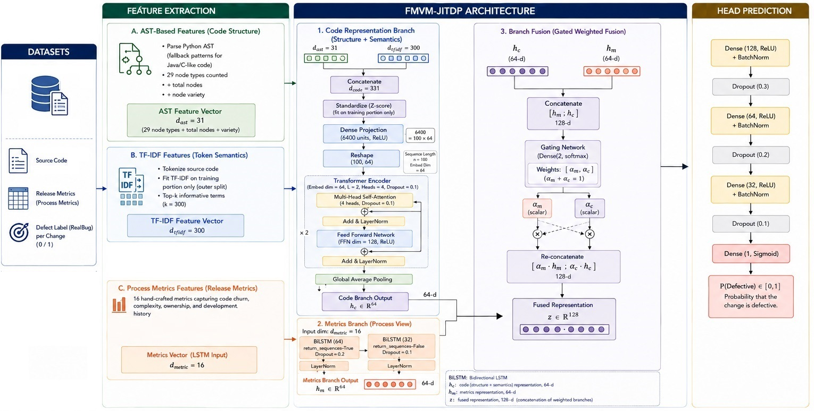

# FMVM-JITDP: Fusing Multi-View Code Change Representations for JIT Defect Prediction

[](#citation)
[](https://www.python.org/)
[](https://www.tensorflow.org/)
[](LICENSE)

Official implementation and dataset for **FMVM-JITDP**, a multi-view fusion model for
Just-in-Time (JIT) software defect prediction. FMVM-JITDP represents each code change from
three complementary perspectives — a **TF-IDF lexical-change delta**, **node-type-level
AST structural-change statistics**, and **sixteen code churn metrics** — and fuses them with
a hybrid **BiLSTM + Transformer** architecture and a **commit-conditional attention** layer.

---

## Overview

Most JIT defect prediction methods observe a commit through a single lens (process, lexical,
or structural), leaving complementary evidence about *what* changed, *how* it changed, and
*how often* the code has changed unexploited. FMVM-JITDP closes three gaps identified in the
paper: (i) single-view blindness, (ii) two-view fusion that is static and post-commit, and
(iii) heterogeneous features forced through a single encoder.

<p align="center">
  
</p>

<p align="center">
  <em><b>Figure 1.</b> Overview of the proposed FMVM-JITDP framework. Three views (AST-based
  structural change, TF-IDF lexical change, and process/churn metrics) are routed through two
  branch-specific encoders — a Transformer branch over the concatenated 331-d code-change
  vector and a two-layer BiLSTM branch over the 16 churn metrics — and combined by a gated
  weighted-fusion layer before the prediction head.</em>
</p>


---

## Key Contributions

1. **Three-view representation.** Each change is described by a TF-IDF lexical delta
   (`d_tfidf = 300`), node-type-level AST edit-script statistics (`d_ast = 31`), and 16 code
   churn metrics — all formulated as *differences* between pre- and post-commit revisions so
   the classifier receives an explicit signal of what changed.
2. **Hybrid two-branch encoder.** A two-layer BiLSTM models interactions among the churn
   metrics; a two-block Transformer processes the concatenated 331-d code-change vector. The
   branches share no parameters, respecting the differing geometries of the two modalities.
3. **Commit-conditional gated fusion.** A softmax attention layer produces per-commit weights
   (α_m, α_c) over the metric and code-change branches, downweighting high-churn/low-lexical
   changes on the code branch and vice versa — behaviour static fusion cannot express.
4. **Comprehensive evaluation.** On nine open-source projects, FMVM-JITDP outperforms seven
   state-of-the-art baselines on all six indicators, with significance confirmed by
   Wilcoxon (Holm–Bonferroni corrected), Cohen's d_z, and Friedman/Nemenyi tests.

---

## Repository Structure

#Will be uploaded soon

---

## Installation

```bash
# #Will be explained soon

---

## The Projects used in this work

FMVM-JITDP is evaluated on the benchmark defect dataset of Yatish et al. (ICSE 2019), further
examined by Wattanakriengkrai et al. (TSE 2020), using **one selected release from each of
nine open-source projects**. For each labeled code-change instance, the lexical and AST views
are built from the pre- and post-change states surrounding the corresponding commit.

| Project (release)     | Domain                          | Retained | Defective rate (%) |
|-----------------------|---------------------------------|---------:|-------------------:|
| ActiveMQ (5.2.0)      | Messaging / integration server  |    2,029 |              10.45 |
| Camel (2.10.0)        | Enterprise integration          |    7,896 |               2.82 |
| Derby (10.3.1.4)      | Relational database             |    2,067 |              27.00 |
| Groovy (1.6.Beta_1)   | JVM programming language        |      809 |               8.03 |
| HBase (0.95.2)        | Distributed data store          |    1,720 |              24.53 |
| Hive (0.9.0)          | Hadoop data warehouse           |    1,378 |              18.58 |
| JRuby (1.7.0)         | Ruby for the JVM                |    1,553 |               3.80 |
| Lucene (2.3.0)        | Text-search library             |      797 |              23.71 |
| Wicket (1.5.3)        | Web-application framework       |    2,567 |               3.93 |


## Citation

If you use this code or dataset, please cite:

```bibtex
@article{abdu2026fmvmjitdp,
  title   = {FMVM-JITDP: Fusing Multi-View Code Change Representations for JIT Defect Prediction},
  author  = {Abdu, Ahmed and Yumbla, Francisco and Al-Mahbashi, Mohammed and Algabri, Redhwan},
  journal = {Scientific Reports},
  year    = {2026},
  note    = {Under revision. Update volume/pages/DOI upon acceptance.}
}
```

